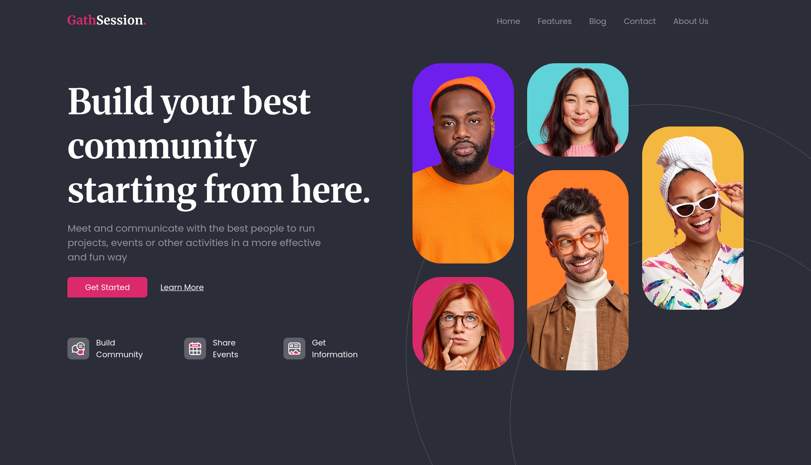

# Heather Gathsession

🔗 [Live Demo](https://irenemendoza.github.io/online-forum/)

A static layout practice project built from a Figma design, focusing on semantic HTML structure and interactive CSS effects.

## 📸 Preview



## ✨ Features

- **Static desktop layout** (non-responsive)
- **Semantic HTML5** structure
- **Interactive hover states** on buttons and links
- **Optimized SVG icons**
- Clean header and hero section implementation
- Pixel-perfect Figma design reproduction

## 🛠️ Tech Stack

- **HTML5** - Semantic structure
- **SCSS/Sass** - CSS preprocessor
- **Vite** - Build tool and dev server
- **SVG** - Scalable icons

## 🚀 Getting Started

### Prerequisites

- Node.js (v14 or higher)
- npm or yarn

### Installation
```bash
# Clone the repository
git clone https://github.com/irenemendoza/online-forum.git

# Navigate to directory
cd online-forum

# Install dependencies
npm install

# Start development server
npm run dev
```

The project will be available at `http://localhost:5173`

## 📦 Available Scripts
```bash
npm run dev      # Development server
npm run build    # Production build
npm run preview  # Preview build
npm run deploy   # Deploy to GitHub Pages
```

## 🚢 Deployment

The project automatically deploys to GitHub Pages:
```bash
npm run deploy
```

This generates the build and publishes it to the `gh-pages` branch.

## 📋 Project Structure
```
online-forum/
├── src/
│   ├── styles/
│   │   ├── _variables.scss
│   │   ├── _mixins.scss
│   │   └── main.scss
│   ├── assets/
│   │   └── icons/
│   └── index.html
├── docs/              # Screenshots
├── package.json
└── vite.config.js
```

## 🎯 Development Focus

- Pixel-perfect Figma design implementation
- Semantic HTML structure
- CSS hover states and transitions
- Reusable SCSS components
- Asset optimization (SVG)
- Clean, organized code architecture

## 📝 Notes

- This is a **static layout** designed for desktop viewing
- The project is **not responsive** - it focuses on layout structure practice
- Optimized for standard desktop resolutions (1200px+)

## 👩‍💻 Author

**Irene Mendoza**
- GitHub: [@irenemendoza](https://github.com/irenemendoza)
- Portfolio: [irenemendoza.github.io](https://irenemendoza.github.io/portfolio-project/)

---

⭐ If you liked this project, give it a star!